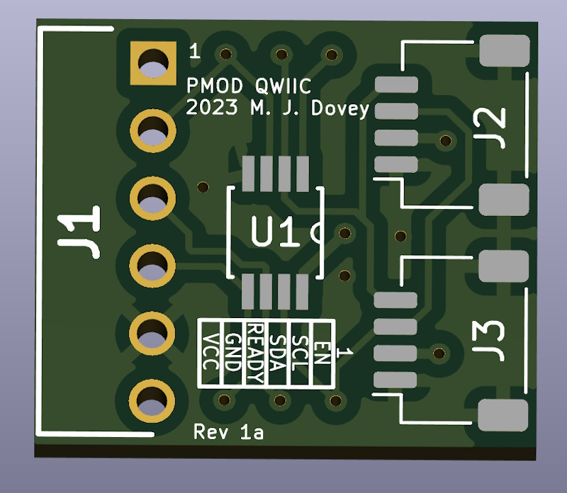

# pmod_qwiic
#### PMOD to QWIIC Adaptor

PMOD module to allow connection to [QWIIC](https://www.sparkfun.com/qwiic) devices.

| Pin  | Name  | Direction | Description    |
| ---- | ----- | --------- | -------------- |
| 1    | EN    | Out       | I2C Bus Enable |
| 2    | SCL   | In/Out    | I2C Clock      |
| 3    | SDA   | In/Out    | I2C Data       |
| 4    | READY | In        | I2C Bus Ready  |

